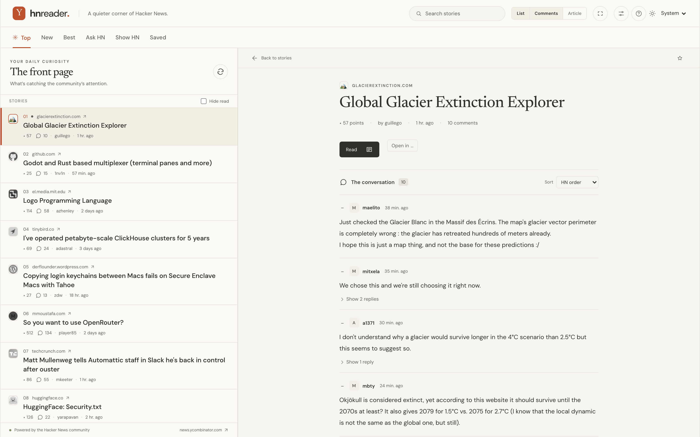

<div align="center">

# HN Reader

**A quieter corner of Hacker News.**

Read-only, keyboard-first, no account and no backend.

[](https://github.com/ersanne/hacker-news-react/actions/workflows/pages.yml)


[**Open the app →**](https://hn.eriksanne.com)



</div>

---

## Features

|  |  |
|---|---|
| 📚 **Five feeds** | Top, New, Best, Ask and Show, 30 stories per batch, refreshed only when you ask |
| 🔍 **Full-text search** | The whole HN archive through Algolia, 30 per page, shareable as `/?q=…` |
| 💬 **Discussions in place** | Beside the feed on desktop, its own screen below 1,024px, threads collapsible |
| 📖 **Article pane** | Reader text or the page itself in a sandboxed frame, three columns from 1,400px |
| 🔖 **Saved & read state** | A saved tab, read indicators, and a “Hide read” filter per feed |
| ⌨️ **Keyboard-first** | `j` `k` to move, `Enter` to open, `r` for the article, `?` for the rest |
| 🌗 **Themes** | System, light and dark, with DM Sans and Newsreader served locally |
| 🔗 **Real URLs** | Every view is linkable, Back and Forward behave, paywalls get an archive.is link |

Original articles, profiles and reply links open on their own sites. Accounts, voting and posting are deliberately out of scope.

## Quick start

Node 22.12 or newer. Versions are pinned in `mise.toml`, and the Node major in `.nvmrc` for nvm.

```sh
mise install     # optional, installs the pinned Node and pnpm
pnpm install
pnpm run dev
```

Vite prints the local URL. No API keys, environment variables or server needed.

With [mise](https://mise.jdx.dev) every script is also a task: `mise run dev`, `build`, `test`, `test-e2e`, `lint`, `typecheck`.

## Checks

```sh
pnpm run typecheck
pnpm run lint
pnpm test
pnpm exec playwright install --with-deps chromium
pnpm run test:e2e
```

Vitest covers the request cache, concurrency, ordering, failed requests, search-result mapping and untrusted HTML. Playwright drives deterministic API fixtures on desktop Chromium and an emulated phone: reading, navigation, pagination, search, shortcuts, the article pane, saved stories, prefetching, themes, partial failures and deep threads. Failures leave screenshots and traces in `test-results/`.

<details>
<summary><b>How it is put together</b></summary>

### Structure

`src/App.tsx` owns URL selection, theme, shortcuts and the visited feed and discussion views. Components handle feed browsing, search results and progressive comments; both story lists render through `src/components/StoryList.tsx`.

### Data

`src/api.ts` is the only place that talks to the network:

- the [official Hacker News API](https://github.com/HackerNews/API) for feeds, stories and comments
- the [HN Algolia search API](https://hn.algolia.com/api), which returns every field a result row needs, so search results are never refetched story by story
- [r.jina.ai](https://jina.ai/reader/) for reader text, called only while the article pane is open — a story URL reaches it only when you read the article there

The client caches responses for five minutes, deduplicates concurrent requests, allows eight at a time, and times out after 15 seconds — 30 for article extraction, which renders a page before answering. Pointing at or focusing a story fetches the comments it opens with, so the click lands on a warm cache. Refresh clears the cache and reloads the current feed; stories never reorder under the cursor. Up to ten recent discussions stay mounted to keep expanded threads and scroll position.

### Storage and safety

Theme, article view, the “Hide read” setting and the latest 2,000 opened and saved story IDs live in local storage; storage failures never block reading. There is no account sync, analytics, service worker or database. Story, comment and extracted article HTML is sanitized with DOMPurify, unsafe article URLs are rejected, and embedded pages run sandboxed without `allow-same-origin` — many sites decline to be framed at all.

</details>

<details>
<summary><b>Hosting</b></summary>

`pnpm run build` produces `dist/` with a `404.html` copy of `index.html`: GitHub Pages serves that for unknown paths, which is what keeps direct discussion links working.

`.github/workflows/pages.yml` runs the checks and publishes `dist/` from `main`. `pnpm run build` deploys nothing by itself.

The site is served at [hn.eriksanne.com](https://hn.eriksanne.com). Three things keep it there:

- `public/CNAME` names the domain, and Vite copies it into every build — without it in the artifact, a deploy drops the custom domain.
- DNS: a `CNAME` record for `hn` pointing at `ersanne.github.io.`
- Repository settings: Pages source set to GitHub Actions, the custom domain entered, and “Enforce HTTPS” enabled once the certificate is issued.

A custom domain serves the build at the domain root, so `BASE_PATH` stays unset. Building with `BASE_PATH=/hacker-news-react/` instead produces a build for the `ersanne.github.io/hacker-news-react/` project path.

</details>

---

This rebuild replaces an earlier Vue 2 / Vuetify prototype, which remains in Git history.
